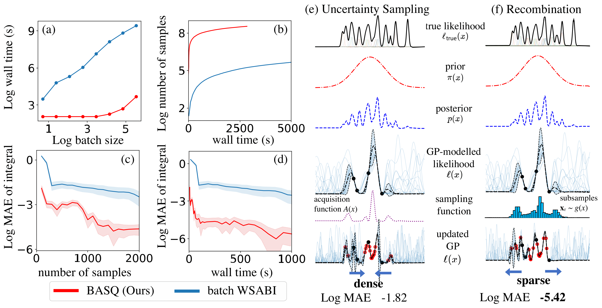

# BASQ: Bayesian Alternately Subsampled Quadrature

This repository contains the python code that was presented for the following paper.

[1] Adachi, M., Hayakawa, S., Jørgensen, M., Oberhauser, and Osborne, M. A. Fast Bayesian Inference with Batch Bayesian Quadrature via Kernel Recombination. Advances in Neural Information Processing Systems 36 (NeurIPS), 2022



BASQ can sample more diverse and more quickly than exsting batch Bayesian Quadrature method.
The data presented in the paper was coded with GPy, which is slower than this code.

## Prerequisite
- PyTorch
- GPyTorch
- BoTorch

## Features
- fast batch Bayesian quadrature
- GPU acceleration
- Arbitrary kernel for Bayesian quadrature modelling
- Arbitrary prior distribution for Bayesian inference

## How to run
```python
python3 main.py
```

The example with Gaussian Mixture Likelihood (dim=10) will run.

## For developers
You can select arbitrary kernels/priors/parameters on ./BASQ/_parametetrs.py
- To change kernel: change "kernel_type", such as Matern52.
- To change prior: change the prior distribution directly as input to the BASQ. The prior must be defined by torch.distributions (see main.py)
- As WSABI and uncertainty sampling is defined only for RBF kernel and normal prior, non-Gaussian kernel or prior will raise errors.
