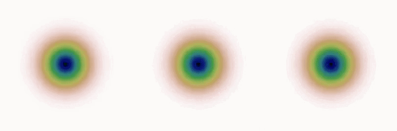

# BASQ: Bayesian Alternately Subsampled Quadrature

This repository contains the python code that was presented for the following paper.

[1] Adachi, M., Hayakawa, S., Jørgensen, M., Oberhauser, H., and Osborne, M. A. Fast Bayesian Inference with Batch Bayesian Quadrature via Kernel Recombination. Advances in Neural Information Processing Systems 35 (NeurIPS), 2022 <br>
[NeurIPS proceedings](https://proceedings.neurips.cc/paper_files/paper/2022/hash/697200c9d1710c2799720b660abd11bb-Abstract-Conference.html), [arXiv](https://arxiv.org/abs/2206.04734), [OpenReview](https://openreview.net/forum?id=9wCQVgEWO2J)


## Brief explanation
<br>

We query 100 points in parallel to the true posterior distribution. Colours represent the GP surrogate model trying to approximate the three true posteriors (Ackley, Oscillatory, Branin-Hoo, see Supplementary Figure 4 for details).
The black dots in the animated GIF is the proposed points by BASQ for each iteration. At the third iteration, BASQ can capture the whole posterior surface.

## Features
- fast batch Bayesian quadrature
- GPU acceleration
- Arbitrary kernel for Bayesian quadrature modelling
- Arbitrary prior distribution for Bayesian inference

## Content
BASQ can sample more diversely and quickly than the existing batch Bayesian Quadrature method (batch WSABI). The data presented in the paper was coded with GPy, which is based on batch WSABI code for comparison. The GPy one is not fast as we won't open but I can share if necessary.
Batch WSABI code is here: [link](https://github.com/OxfordML/bayesquad)

## Requirements
- PyTorch
- GPyTorch
- BoTorch

## Example
```python
python3 main.py
```

The example with Gaussian Mixture Likelihood (dim=10) will run.

You can find the detailed example applied to Bayesian model selection:
[Bayesian Model Selection with BASQ](https://github.com/Battery-Intelligence-Lab/BayesianModelSelection)

## For developers/researchers
You can select arbitrary kernels/priors/parameters on ./BASQ/_parametetrs.py
- To change kernel: change "kernel_type", such as Matern52.
- To change prior: change the prior distribution directly as input to the BASQ. The prior must be defined by torch.distributions (see main.py)
- As WSABI and uncertainty sampling is defined only for RBF kernel and normal prior, non-Gaussian kernel or prior will raise errors.

## Cite as

Please cite this work as
```
@article{adachi2022fast,
  title={Fast Bayesian Inference with Batch Bayesian Quadrature via Kernel Recombination},
  author={Adachi, Masaki and Hayakawa, Satoshi and Jørgensen, Martin and Oberhauser, Harald and Osborne, Michael A.},
  journal={Advances in Neural Information Processing Systems 35 (NeurIPS 2022)},
  year={2022}
}

```
